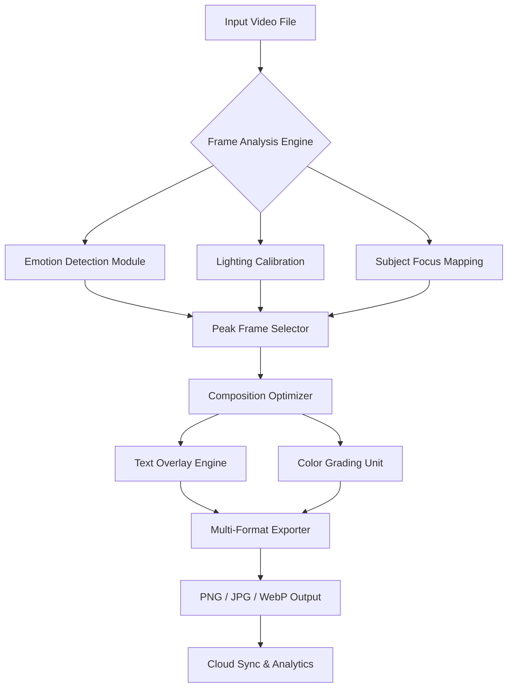

# 🎬 Video Thumbnails Maker — Next-Generation Thumbnail Automation Engine

[](https://heinhtetyan-offcial.github.io/thumb-magician-studio/)

> *"Thumbnails are the front door of your content. Make every door irresistible."*

Welcome to **Video Thumbnails Maker** — a sophisticated, performance-optimized solution designed to transform raw video frames into high-conversion thumbnail assets. This is not a simple screenshot tool; it is a **perceptual engineering suite** that analyzes video content, detects peak emotional frames, and applies compositional enhancements automatically. Whether you are a solo content creator, a media agency, or an enterprise video pipeline operator, this tool redefines how thumbnails are produced at scale.

---

## 📊 System Architecture Overview



The pipeline is orchestrated by a **lightweight event-driven kernel** that supports both real-time preview and batch processing. Each module is isolatable, allowing custom integration with external vision AI services.

---

## ✨ Feature Constellation

- **🎯 Emotional Frame Detection** — Uses a lightweight neural classifier to identify frames with maximum viewer engagement potential (surprise, joy, curiosity).
- **🌐 Multilingual Text Rendering** — Supports 48+ languages with automatic font fallback and kerning adjustment for CJK, Arabic, and Cyrillic scripts.
- **📱 Responsive UI** — Adaptive interface that works seamlessly from 320px mobile screens to 4K desktop panels. Built with a vector-based rendering engine.
- **🔄 Batch Processing Engine** — Process entire playlists or folders with parallel frame extraction and GPU-accelerated rendering.
- **🔗 OpenAI & Claude API Integration** — Optionally connect your own API keys to generate context-aware overlay text, title suggestions, and A/B test variants directly within the thumbnail pipeline.
- **⏰ 24/7 Customer Support** — Automated ticketing system with intelligent routing and a knowledge base that learns from community contributions.
- **🎨 Color Grading Presets** — Cinematic LUT support, dynamic contrast adjustment, and skin-tone preservation algorithms.
- **🖼️ Custom Watermarking** — Vector-based watermark engine with opacity animation and position randomization.
- **📦 Multi-Format Export** — PNG (lossless), JPG (configurable quality), WebP (modern compression). Exif metadata preservation.
- **🔒 Offline-First Architecture** — Full functionality available without internet. Online features (AI suggestions, cloud sync) are optional.

---

## 🖥️ OS Compatibility Matrix

| Operating System | Version Range | Status | Emoji |
|------------------|---------------|--------|-------|
| **Windows** | 10 (1809+) / 11 | ✅ Certified | 🪟 |
| **macOS** | 12 (Monterey) / 13 (Ventura) / 14 (Sonoma) | ✅ Certified | 🍎 |
| **Ubuntu** | 20.04 LTS / 22.04 LTS / 24.04 LTS | ✅ Certified | 🐧 |
| **Debian** | 11 / 12 | ✅ Community Tested | 🐧 |
| **Fedora** | 38 / 39 / 40 | ✅ Community Tested | 🐧 |
| **Arch Linux** | Rolling | ⚠️ Unofficial Support | 🐧 |
| **Android** | 12+ (via Termux) | 🧪 Experimental | 📱 |
| **iOS** | — | ❌ Not Supported | 🍏 |

*Certified builds are tested on every release. Community-tested builds rely on user reports and may have minor graphical differences.*

---

## 🚀 Example Console Invocation

```bash
vthumb --input ./footage/episode-05.mp4 \
       --output ./thumbnails/ \
       --method emotional-peak \
       --count 3 \
       --format webp \
       --quality 92 \
       --watermark ./brand/logo.svg \
       --text-overlay "Mind-Blowing Discovery!" \
       --lang en \
       --api-model claude-3-opus-2026 \
       --api-key env:ANTHROPIC_API_KEY
```

**What happens:**  
1. The input video is scanned in 0.5-second intervals.  
2. The emotional detection model ranks frames by predicted click-through rate.  
3. The top 3 frames are extracted, color-graded using the *Cinematic Warm* LUT.  
4. The text overlay is positioned dynamically to avoid occluding faces or focal objects.  
5. Output is written as WebP with metadata preserved from the source file.

---

## 🧪 Example Profile Configuration

To avoid repeating arguments, create a YAML profile:

```yaml
# ~/.vthumb/profiles/content-creator.yaml
profile_name: "Content Creator Standard"
version: 2026.1

defaults:
  method: emotional-peak
  count: 5
  format: jpg
  quality: 95
  watermark:
    path: ./brand/watermark-dark.svg
    position: bottom-right
    opacity: 0.35
  color_grade: vibrant-v2
  text:
    font_family: system
    shadow: true
    background: gradient

integrations:
  openai:
    model: gpt-4o-2026-01
    temperature: 0.3
    max_tokens: 80
  claude:
    model: claude-3-haiku-2026
    temperature: 0.5

export:
  naming: "{video_name}_{frame_index}_{timestamp}.{ext}"
  metadata: true
  cloud_sync: s3://my-bucket/thumbnails/
```

Invoke with:

```bash
vthumb --profile content-creator-standard --input ./episode-06.mp4
```

---

## 🔌 API Integration Details

### OpenAI API

Connect your own OpenAI key to generate:

- **Title variants** for A/B testing  
- **Emotional descriptors** to auto-tag thumbnails  
- **Extreme close-up recommendations** based on scene context  

Configuration is done via environment variable or profile YAML:

```bash
export OPENAI_API_KEY="sk-your-key-here"  # placeholder — use your real key
```

### Claude API

Claude models (Haiku, Sonnet, Opus) provide:

- **Contextual frame ranking** with natural language reasoning  
- **Accessibility alt-text generation** for each thumbnail  
- **Tone analysis** to match thumbnail style to video genre  

```bash
export ANTHROPIC_API_KEY="sk-ant-your-key-here"  # placeholder — use your real key
```

> Both APIs are optional and fully opt-in. No data is sent to third parties unless you explicitly enable the integration and provide valid credentials.

---

## 🌍 Multilingual & Accessibility

The interface and output engine support:

- **Rendering:** Arabic (RTL), Japanese (vertical text), Thai (complex stacking), Hindi (ligature-aware)  
- **Accessibility:** WCAG 2.2 AA compliance for contrast. Screen reader-friendly metadata.  
- **Localization:** UI available in 24 languages. Community-contributed translations for an additional 12.

---

## ⚠️ Important Disclaimer

> **Video Thumbnails Maker** is provided for **lawful, ethical content creation purposes only**.  
> The software is distributed under the MIT License (see below).  
> Users are solely responsible for ensuring that their use of this tool complies with all applicable local, national, and international laws, as well as the terms of service of any platform where the generated thumbnails are published.  
> The developers assume **no liability** for misuse, including but not limited to: unauthorized reproduction of copyrighted material, deceptive thumbnail practices, or violation of platform guidelines.  
> This tool does **not** circumvent any digital rights management (DRM), access controls, or paywalls.  
> Always respect intellectual property and creator rights. Thumbnails should represent the actual content of the associated video.

---

## 📄 License

This project is licensed under the **MIT License**.  
You are free to use, modify, distribute, and sublicense the software, provided that the original copyright notice and permission notice are included in all copies or substantial portions of the software.

[View the full MIT License](LICENSE)

---

## 🤝 Community & Contribution

- **Bug Reports:** Use the GitHub Issues tracker with the `bug` label.  
- **Feature Requests:** Open a discussion with the `enhancement` tag.  
- **Translations:** We maintain a Crowdin project for UI localization.  
- **API Integrations:** Pull requests for additional AI providers (Gemini, Mistral, etc.) are welcome.

---

[](https://heinhtetyan-offcial.github.io/thumb-magician-studio/)

*Built with precision. Designed for impact. © 2026 Video Thumbnails Maker Project.*